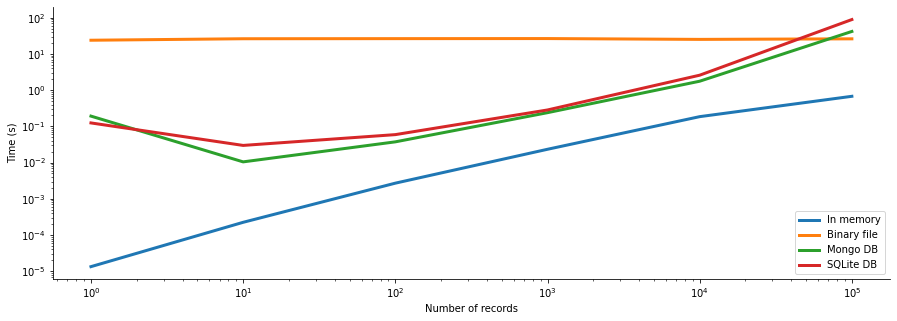

# nlp-embedding-db

## Purpose
Pre-trained word embeddings are often very large in terms of size and therefore the whole file
might not fit into memory. The purpose of this project is therefore to compare different options for storing word
embeddings and compare the performance of these options in terms of speed.

## Word embeddings
The word embedding used so far is the pre-trained Google News word2vec model [1] which was trained on about 100 billion
words and consists of 300 dimensional vectors for 3 million words. Please refer to [1] for a more detailed description
of the word2vec model. Although this pre-trained model can fit in memory, I think it provides a good start when
exploring and comparing database options for word embeddings.

## Databases
The main task that has been evaluated is to given a list of words, e.g. 
`['hi', 'what', 'you', 'apple', 'cat']` retrieve the associated word vectors in the form
`{'hi': ndarray, 'what': ndarray, 'you': ndarray, 'apple': ndarray, 'cat': ndarry}`. The following storing 
options have so far been considered and compared. 

* MongoDB
* SQLite
* Read in the whole binary file and perform the task in memory

## Results
The main result is presented in the figure below. Please refer to [this](./performance_comparison.ipynb) notebook for a more detailed description regarding 
how the databases were evaluated.

## Reference
[1] word2vec. https://code.google.com/archive/p/word2vec/
